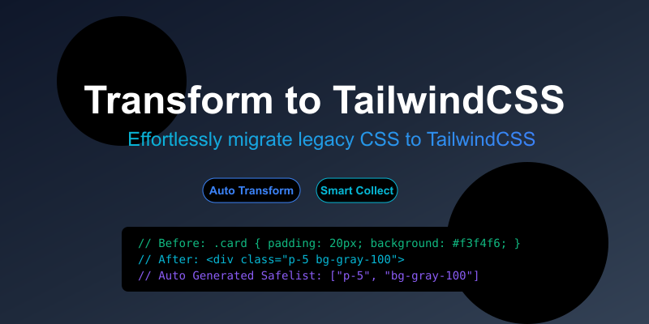

<p align="center">

</p>
<p align="center"> <a href="./README.md">English</a> | 简体中文</p>

> WIP

这个库就是把 css 转成 tailwindcss 的。 [tailwindcss](https://tailwindcss.com/) 可以更好的复用样式减少打包体积，可以转化为一种性能优化的方式，也可以让老项目更容易升级到 tailwindcss。如果你是 [unocss](https://github.com/unocss/unocss) 使用者, 你可以尝试使用 [transformToUnocss](https://github.com/Simon-He95/transformToUnocss)。

## 📦 Install

```
  npm i -g transform-to-tailwindcss
```

## 🦄 cli

```
  ## command: totailwindcss + directory
  totailwindcss playground

  ## revoke: totailwindcss + directory + --revert
  totailwindcss payground --revert
```

## 🌈 Usage

<details>
<summary>Vite</summary>

```ts
// vite.config.ts
import { vitePluginTransformTotailwindcss } from 'transform-to-tailwindcss'
export default defineConfig({
  plugins: [vitePluginTransformTotailwindcss(/* options */)],
})
```

</details>
<br>
<details>
<summary>Rollup</summary>

```ts
// rollup.config.js
import { resolve } from 'node:path'
import { rollupTransformTotailwindcss } from 'transform-to-tailwindcss'
export default {
  plugins: [rollupTransformTotailwindcss(/* options */)],
}
```

</details>
<br>
<details>
<summary>Webpack</summary>

```ts
// webpack.config.js
module.exports = {
  /* ... */
  plugins: [
    require('transform-to-tailwindcss').webpackTransformTotailwindcss({
      /* options */
    }),
  ],
}
```

</details>
<br>
<details>
<summary>Vue CLI</summary>

```ts
// vue.config.js
module.exports = {
  configureWebpack: {
    plugins: [
      require('transform-to-tailwindcss').webpackTransformTotailwindcss({
        /* options */
      }),
    ],
  },
}
```

</details>
<br>
<details>
<summary>Esbuild</summary>

```ts
// esbuild.config.js
import { build } from 'esbuild'
import { esbuildTransformTotailwindcss } from 'transform-to-tailwindcss'

build({
  plugins: [esbuildTransformTotailwindcss(/* options */)],
})
```

</details>

# ⭐ Feature

- 支持 css 在 '.html' | '.tsx' | '.vue' | '.astro' | '.svelte' 转换到 tailwindcss
- 支持 sass less stylus 类型的转换
- 支持 vite | rollup | webpack | vue-cli | esbuild 作为插件使用
- vscode 扩展 [To tailwindcss](https://github.com/Simon-He95/totailwindcss)

## 编译前


## 编译后


## :coffee:

[请我喝一杯咖啡](https://github.com/Simon-He95/sponsor)

## License

[MIT](./license)
